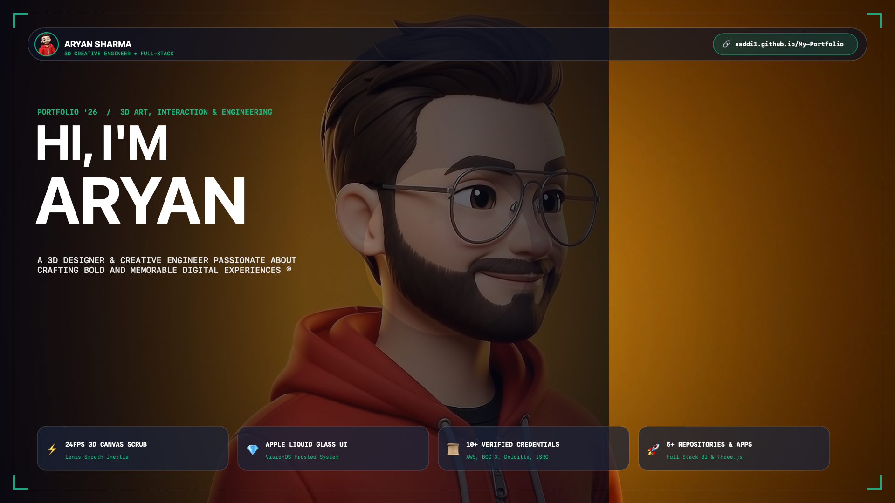

<div align="center">

```
   █████╗ ██████╗ ██╗   ██╗ █████╗ ███╗   ██╗    ███████╗██╗  ██╗ █████╗ ██████╗ ███╗   ███╗ █████╗ 
  ██╔══██╗██╔══██╗╚██╗ ██╔╝██╔══██╗████╗  ██║    ██╔════╝██║  ██║██╔══██╗██╔══██╗████╗ ████║██╔══██╗
  ███████║██████╔╝ ╚████╔╝ ███████║██╔██╗ ██║    ███████╗███████║███████║██████╔╝██╔████╔██║███████║
  ██╔══██║██╔══██╗  ╚██╔╝  ██╔══██║██║╚██╗██║    ╚════██║██╔══██║██╔══██║██╔══██╗██║╚██╔╝██║██╔══██║
  ██║  ██║██║  ██║   ██║   ██║  ██║██║ ╚████║    ███████║██║  ██║██║  ██║██║  ██║██║ ╚═╝ ██║██║  ██║
  ╚═╝  ╚═╝╚═╝  ╚═╝   ╚═╝   ╚═╝  ╚═╝╚═╝  ╚═══╝    ╚══════╝╚═╝  ╚═╝╚═╝  ╚═╝╚═╝  ╚═╝╚═╝     ╚═╝╚═╝  ╚═╝
```

### ⚡ HIGH-PERFORMANCE 3D SCROLL CANVAS &bull; APPLE CLEAR LIQUID GLASS PORTFOLIO ⚡

[](https://aaddi1.github.io/My-Portfolio/)
[](https://github.com/aaddi1)
[](https://www.linkedin.com/in/aryan-sharma11/)
[-@aryan56710-000000?style=for-the-badge&logo=x&logoColor=white)](https://x.com/aryan56710)
[](https://www.instagram.com/aryansharma.dev/)

<br/>



<br/><br/>

[](https://github.com/aaddi1/My-Portfolio)
[](https://github.com/darkroomengineering/lenis)
[](https://github.com/aaddi1/My-Portfolio)
[](https://vitejs.dev/)
[](https://aaddi1.github.io/My-Portfolio/)
[](./LICENSE)

</div>

---

## 🌐 Live Deployment

Experience the interactive 3D scroll canvas and Apple Clear Liquid Glass system:
> 🔗 **[https://aaddi1.github.io/My-Portfolio/](https://aaddi1.github.io/My-Portfolio/)**

---

## 🚀 Overview & Architecture

**Aryan Sharma's Digital Portfolio** is an ultra-fast, cinematic, interactive web engineering showcase designed with an asynchronous **24fps 3D frame scrubbing canvas engine** synchronized to **Lenis inertial smooth scrolling**, paired with a **VisionOS-inspired Apple Clear Liquid Glass UI architecture**.

```
┌────────────────────────────────────────────────────────────────────────┐
│                        VIEWPORT & BROWSER WINDOW                       │
├────────────────────────────────────────────────────────────────────────┤
│  [ Fixed Header ] Avatar Logo + Navigation + Status Pulse Dot          │
│                                                                        │
│  ┌──────────────────────────────────────────────────────────────────┐  │
│  │                     FOREGROUND UI LAYER (Z: 10)                  │  │
│  │  • Hero Typographic Display + Infinite Brand Marquee             │  │
│  │  • About Me (Framed Avatar + Experience Telemetry)               │  │
│  │  • 5x Services Grid (3D Modeling, Shaders, Animations, CAD)      │  │
│  │  • 4x Featured Repositories (NEXUS, Cinder House, Advocate, Star)│  │
│  │  • 16x Verified Credentials (With Filter Tabs & Modal Lightbox)  │  │
│  │  • Verified Client Reviews & Interactive Contact Form            │  │
│  │  • 4-Column Footer + Official 2-Page Legal Notice (PDF)          │  │
│  └──────────────────────────────────────────────────────────────────┘  │
│                                                                        │
│  ┌──────────────────────────────────────────────────────────────────┐  │
│  │                BACKGROUND 3D CANVAS ENGINE (Z: 0)                │  │
│  │  • 240 Compressed High-Definition 1080p JPEG Frames              │  │
│  │  • Retina High-DPI Scaling (DevicePixelRatio Clamped)            │  │
│  │  • requestAnimationFrame Lerp Interpolation (Damping 0.22)       │  │
│  │  • Concurrency Prefetch Pool (16 Parallel Threads + Async Decode)│  │
│  │  • Nearest-Neighbor Frame Fallback for Zero Jitter               │  │
│  └──────────────────────────────────────────────────────────────────┘  │
└────────────────────────────────────────────────────────────────────────┘
```

---

## ✨ Core Features

### 🎬 1. High-Speed 3D Canvas Frame Engine
- **240 Full HD Frames:** Seamlessly scrubs 24fps motion graphics relative to scroll progress.
- **Async Decoding (`img.decode()`):** Offloads JPEG decompression from the main UI thread to prevent scroll hitching.
- **Retina High-DPI Cover Fitting:** Dynamically scales to `window.devicePixelRatio` without distortion across ultrawide monitors, MacBooks, tablets, and smartphones.
- **Lenis Smooth Scroll Lerp:** Interpolates frame indices with cubic-bezier easing for buttery 120Hz/60Hz frame scrubbing.

### 💎 2. Apple VisionOS Clear Liquid Glass UI
- **Multi-Layer Specular Gradients:** Subtle light-refracting highlights angled across all interactive cards.
- **Deep Frosted Backdrop Filter:** `backdrop-filter: blur(32px) saturate(210%) brightness(108%)` allowing the 3D models to illuminate through translucent glass panels.
- **Squircle Geometries:** 24px Apple squircle curvature with inner prism borders.
- **Hover Micro-Interactions:** Elevation lift and dynamic specular sheen on cards and badges.

### 📜 3. Verified Credentials & Interactive Lightbox
- **17 Verified Certifications & Badges:** Features IBM SkillsBuild (AI Fundamentals), Oracle Java Learning Explorer, Google Play Academy, Claude Academy (101, CLI & In Action), Microsoft Blazor, AWS Cloud Developer, BCG X Generative AI, Bank of America Global Markets, Deloitte Cybersecurity, ISRO / IIRS Outreach, HP LIFE, Mastercard Consulting, and Scaler Academy.
- **Category Filter Tabs:** Instant sorting by `ALL (17)`, `AI & CLAUDE`, `CLOUD & GOOGLE`, `ENTERPRISE`, and `ENGINEERING`.
- **Generated PNG Document Previews:** Instant visual previews with zoom expand triggers and modal lightbox support for PDF inspection.

### 📂 4. Featured GitHub Repositories
- **[NEXUS](https://github.com/aaddi1/NEXUS):** Full-stack business management platform with CRM, real-time inventory tracking, and predictive analytics (Node.js, PostgreSQL, Python, C++).
- **[Cinder House](https://github.com/aaddi1/Cinder-House):** Boutique luxury hotel experience featuring Three.js 3D spatial visuals and liquid glass styling.
- **[Advocate Webpage](https://github.com/aaddi1/Advocate-webpage):** High-conversion legal tech practice platform with client consultation workflows.
- **[Star Inn](https://github.com/aaddi1/Restaurant-webpage):** Contemporary dining & hospitality showcase with interactive menu navigation.

---

## 🛠️ Tech Stack & Dependencies

| Category | Technologies / Libraries |
| :--- | :--- |
| **Frontend Core** | HTML5 Semantic Markup, ESNext JavaScript, CSS3 Custom Properties |
| **Graphics & 3D** | HTML5 Canvas 2D Context, WebGL, Three.js, CoreGraphics |
| **Scroll Animation** | [Lenis](https://github.com/darkroomengineering/lenis) (Smooth Inertial Scrolling) |
| **Build & Tooling** | [Vite 6](https://vitejs.dev/) (ESBuild, Hot Module Replacement) |
| **Typography** | Syne (Display), Space Grotesk (Body), JetBrains Mono (Technical/Metadata) |
| **Legal Document** | Apple PDFKit / CoreGraphics (2-Page Searchable Vector PDF with Embedded Seal) |

---

## 📦 Local Development Quickstart

### Prerequisites
- [Node.js](https://nodejs.org/) (v18+ recommended)
- `npm` or `pnpm` or `yarn`

### Setup Instructions

```bash
# 1. Clone the repository
git clone https://github.com/aaddi1/My-Portfolio.git
cd My-Portfolio

# 2. Install dependencies
npm install

# 3. Start local development server
npm run dev

# 4. Open in browser
# Local URL: http://localhost:5173/
```

### Production Build

```bash
# Build optimized production bundle
npm run build

# Preview production build locally
npm run preview
```

---

## ⚖️ Intellectual Property, Copyright & Legal Terms

All visual designs, 3D frame sequences, shader programs, layout frameworks, and source code in this repository are the exclusive proprietary property of **Aryan Sharma**.

- **Proprietary Notice:** © 2026 Aryan Sharma. All Rights Reserved. See [**`LICENSE`**](./LICENSE).
- **Prohibitions:** Unauthorized copying, commercial replication, automated scraping, or AI model ingestion is strictly prohibited and subject to civil statutory damages (up to $150,000 USD per work) and criminal prosecution under applicable intellectual property statutes.
- **Official Legal Deed:** Read the complete 2-page registered legal document: [**`public/legal-notice.pdf`**](./public/legal-notice.pdf)

---

## 📬 Contact & Connect

<div align="center">

**Aryan Sharma** &bull; 3D Designer &amp; Creative Engineer  
📍 *Tundla, Uttar Pradesh 283204, India (Available Worldwide &bull; Remote)*

| Platform | Direct Link |
| :--- | :--- |
| 📧 **Email** | [aaddisharmarkczw@gmail.com](mailto:aaddisharmarkczw@gmail.com) |
| 📱 **Phone** | [+91 97286 24010](tel:+919728624010) |
| 💼 **LinkedIn** | [linkedin.com/in/aryan-sharma11](https://www.linkedin.com/in/aryan-sharma11/) |
| 💻 **GitHub** | [github.com/aaddi1](https://github.com/aaddi1) |
| 🐦 **X (Twitter)** | [@aryan56710](https://x.com/aryan56710) |
| 📸 **Instagram** | [@aryansharma.dev](https://www.instagram.com/aryansharma.dev/) |

</div>

<br/>

<div align="center">
  <sub>Engineered with precision by <strong>Aryan Sharma</strong>. Built with 24fps 3D scroll canvas &amp; Apple Clear Liquid Glass.</sub>
</div>
